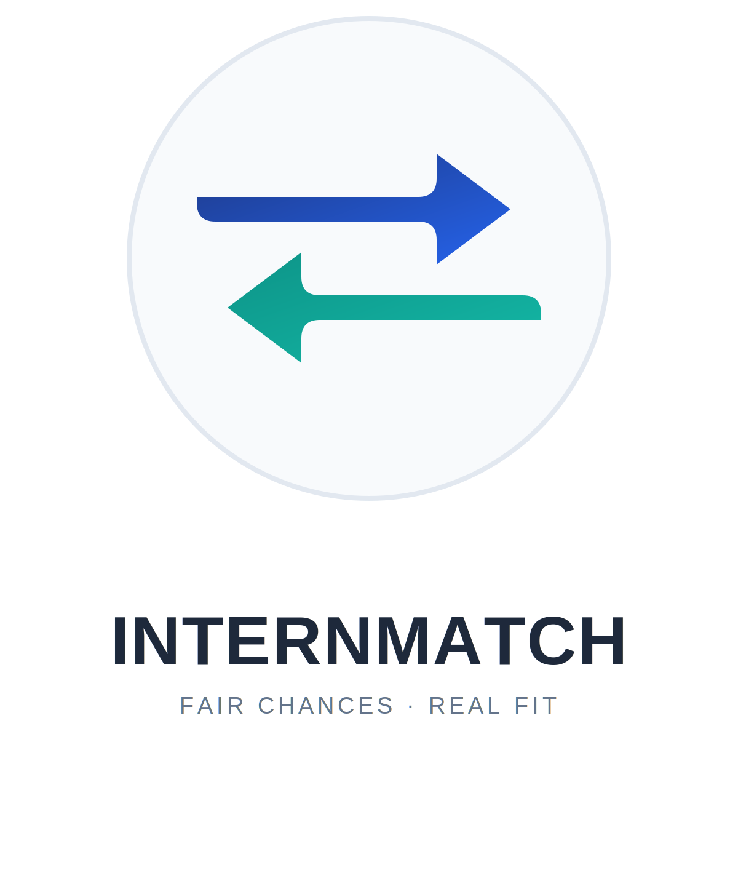

<div align="center">



<br/>

[](./LICENSE)
[](#roadmap)
[](#tech-stack)
[](#tech-stack)
[-3ECF8E?logo=supabase&logoColor=white)](#tech-stack)

### Build in a weekend. Match with confidence.

InternMatch is a two-sided, preference-based internship matching platform — students rank the companies they want, companies rank the students they want, and a fair matching algorithm finds the best mutual fit for both sides.

</div>

---

## Table of Contents

- [Overview](#overview)
- [The Problem](#the-problem)
- [How It Works](#how-it-works)
- [Features](#features)
- [Tech Stack](#tech-stack)
- [Database Schema](#database-schema)
- [Getting Started](#getting-started)
- [Roadmap](#roadmap)
- [Author](#author)
- [License](#license)

## Overview

Most internship placement today is a one-way street: a student applies, and waits. There's no visibility into fit, no way to signal genuine mutual interest, and no guarantee the outcome reflects what either side actually wants.

**InternMatch flips that model.** Both students and companies submit ranked preferences, and a matching algorithm — inspired by the same class of stable-matching systems used in national medical residency placement (Gale–Shapley) — pairs them based on mutual interest rather than who applied first or who has the single highest GPA.

## The Problem

- Students send out applications with no sense of where they realistically stand.
- Companies evaluate candidates in isolation, blind to competing interest elsewhere.
- Popular companies get flooded with applicants; others struggle to reach qualified students.
- The process rewards speed and single metrics over genuine, holistic fit.

InternMatch replaces "applying" with **ranking**, and replaces manual review queues with a **transparent, automated match**.

## How It Works

Each matching round runs in five steps:

1. **Profile, once** — a student's department, year, skills, projects, certificates, and portfolio are set up once and reused every round.
2. **Filtered browsing** — students see postings relevant to their department and skills by default, with the option to view the full list.
3. **Ranking is the application** — instead of applying company-by-company, a student submits one ordered list of postings. That list *is* the application.
4. **Shortlisting & interviews** — companies review their applicant pool, shortlist candidates worth a closer look, and run interviews (or portfolio reviews, take-home tasks, whatever they choose) before finalizing their judgment. This is the company's holistic evaluation step — nothing about it is automated or scored by a formula.
5. **Company ranking & matching** — after interviews, companies submit their final ranking (or a 1–10 score per candidate) for everyone they evaluated. Once the round closes, both sides' rankings are locked and the matching algorithm runs.

### The matching algorithm

For every student–company pair with mutual interest, InternMatch computes a **mutual interest score**:

```
score = 1 / (student's rank of company) + 1 / (company's rank of student)
```

All pairs are sorted by score, highest first. The algorithm walks the sorted list once: if both sides are still free, they're matched; if either is already taken, it moves on. One sort, one pass — no iterative propose-and-reject loop — while still producing an outcome that reflects genuine mutual preference on both sides.

## Features

- **Student profiles** — department, year, skills, projects, certificates, portfolio, availability
- **Smart posting filters** — relevant postings surfaced automatically, with a toggle to browse everything
- **Preference-based applications** — one ranked list per round replaces per-company applications and cover letters
- **Shortlisting & interview workflow** — companies narrow their applicant pool to a shortlist and run interviews before submitting a final ranking, so evaluation stays a genuine human process, not an automated score
- **Holistic company review** — companies rank or score candidates however they choose (skills, projects, interviews, GPA — their call)
- **Score-based greedy matching** — a fast, explainable algorithm that favors genuine mutual fit
- **Locked rounds** — rankings freeze at the deadline so matching runs against a stable snapshot

## Tech Stack

| Layer | Technology |
|---|---|
| Frontend | React (JavaScript) |
| Backend | Node.js + Express (REST API) |
| Database | Supabase (PostgreSQL) |
| Auth | Supabase Auth |
| Matching Engine | Custom score-based greedy matching algorithm |

## Database Schema

```
students          (id, department, year, skills[], portfolio_url, ...)
postings          (id, company_id, required_department, required_skills[], capacity)
student_rankings  (student_id, round_id, ordered_posting_ids[])   -- this row IS "the application"
company_rankings  (posting_id, round_id, ordered_student_ids[] or scores)
```

## Getting Started

```bash
git clone https://github.com/edenalemayheu/InternMatch.git
cd InternMatch
npm install
npm run dev
```

## Roadmap

- [ ] Student profile creation & editing
- [ ] Posting creation & department/skill filtering
- [ ] Ranking submission UI (student side)
- [ ] Shortlisting & interview scheduling (company side)
- [ ] Scoring/ranking UI (company side)
- [ ] Score-based greedy matching engine
- [ ] Match results & notifications
- [ ] Admin dashboard for managing rounds

## Author

**Eden Alemayehu**
Individual project — designed, built, and maintained solo.

[GitHub](https://github.com/edenalemayheu)

## License

Distributed under the MIT License. See [LICENSE](./LICENSE) for details.

<div align="center">

**INTERNMATCH**
*Fair Chances. Real Fit.*

</div>